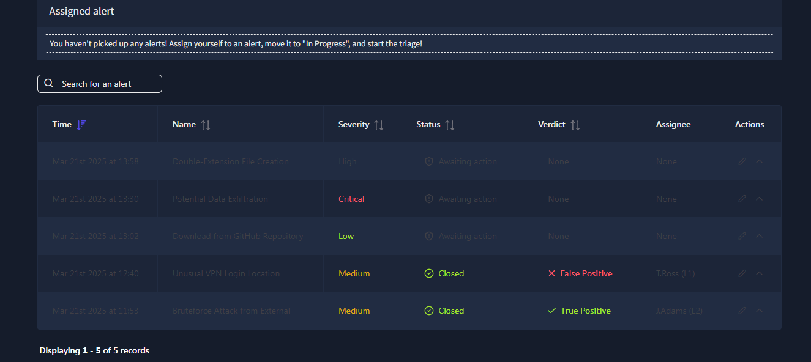
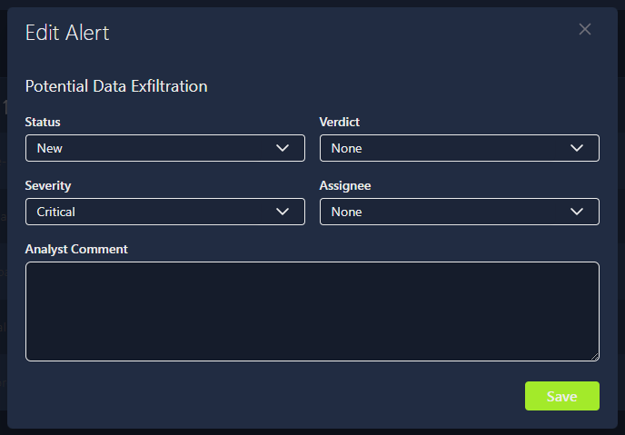

# SOC L1 Alert Triage - TryHackMe

This repository documents my completion of the **SOC L1 Alert Triage** room on TryHackMe.

The objective of this lab is to simulate the daily workflow of a **SOC Level 1 analyst**, focusing on alert triage within a SIEM environment. The room provides hands-on experience with prioritizing, investigating, and classifying security alerts.

---

## 🧠 What I Learned

- How alerts are generated from events and logs
- Understanding SIEM alert properties (severity, status, verdict, assignee)
- Alert prioritization based on severity (Critical, High, Medium, Low)
- Differentiating **True Positives** from **False Positives**
- Investigating critical alerts such as potential data exfiltration
- Handling common threats like double-extension file attacks
- Applying a structured alert triage workflow (assign, in progress, verdict, closure)
- Documenting analysis and decisions inside a SIEM

---

## 🛠️ Skills Practiced

- SOC Level 1 alert triage
- SIEM fundamentals
- Incident prioritization
- Security event analysis
- Blue Team operational mindset
- Cybersecurity fundamentals

---

## 📸 Screenshots

Screenshots related to the lab and alert triage workflow are stored in:

